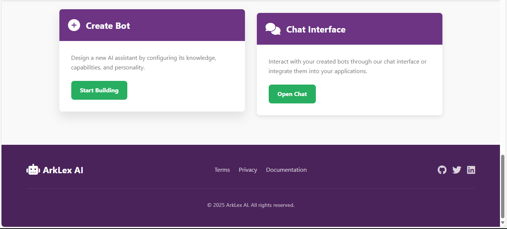
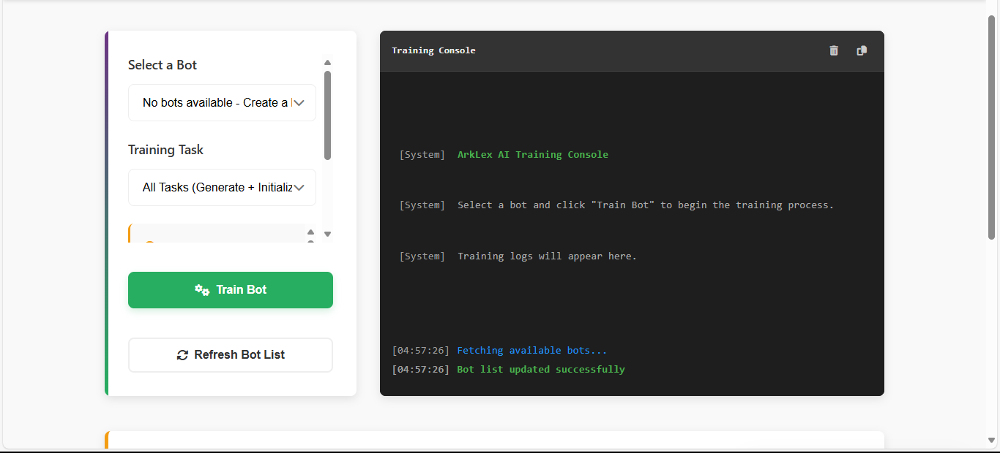
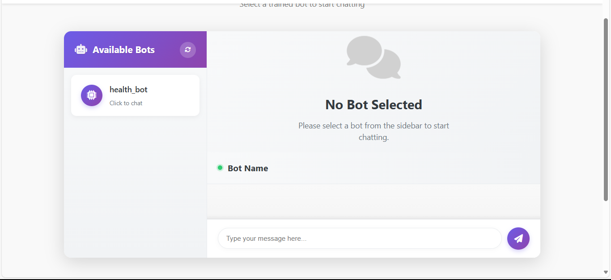
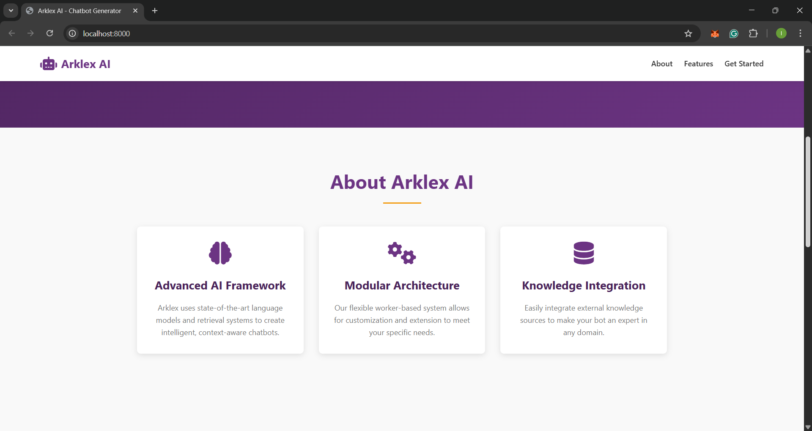

A comprehensive web app for creating, training, and deploying sophisticated AI chatbots using the Arklex framework. This platform provides an end-to-end solution for building conversational agents with advanced natural language understanding capabilities.

## Overview

## Key Features

- **Intuitive Bot Creation**: User-friendly interface for configuring chatbots with custom roles, domains, and objectives
- **Advanced Training Pipeline**: Real-time training process with live terminal output and interactive user input
- **Knowledge Integration**: Seamless incorporation of various knowledge sources for enhanced bot intelligence
- **Modular Architecture**: Worker-based system allowing for specialized bot capabilities
- **Real-time Chat Interface**: WebSocket-powered chat experience with persistent sessions
- **Responsive Design**: Professional UI that works across desktop and mobile devices
- **Session Management**: Robust handling of chat sessions with proper resource allocation and cleanup

## Project Structure

```
.
├── backend/                # Server-side Python code
│   ├── main.py             # Main server entry point with WebSocket and HTTP servers
│   ├── json_config.py      # Configuration file generation and management
│   ├── train_bot.py        # Bot training orchestration module
│   ├── chatter.py          # Chat session management system
│   └── logs/               # Server and training logs
├── frontend/               # Client-side web interface
│   ├── index.html          # Landing page with platform overview
│   ├── create-bot.html     # Comprehensive bot configuration interface
│   ├── train-bot.html      # Interactive training console with real-time feedback
│   ├── chat.html           # Advanced chat interface for bot interaction
│   └── static/             # Static assets
│       ├── css/            # Stylesheets including responsive design
│       ├── js/             # Client-side JavaScript for dynamic interactions
│       └── images/         # Visual assets and branding elements
├── kb/                     # Knowledge base directory
│   └── [bot_name]/         # Bot-specific directories containing:
│       ├── config.json     # Bot configuration
│       ├── taskgraph.json  # Generated conversation flow
│       ├── vector_store/   # Embeddings for knowledge retrieval
│       └── database/       # Structured data storage (when applicable)
├── requirements.txt        # Python dependencies
└── readme.md               # Project documentation
```
## Installation

1. Clone the repository:

```bash
git clone git@github.com:amtulifra/Agent-First-Organization.git
cd assignment1
```

2. Create a virtual environment and install dependencies:

```bash
conda create -n my_env python==3.12
conda activate my_env
pip install -r requirements.txt
```

3. Set up environment variables (optional):

```bash
cp .env.example .env
# Edit .env with your configuration
```

## Running the Application

Start the application with:

```bash
python backend/main.py
```

This will:
- Initialize the knowledge base directory structure
- Start the WebSocket server on port 8001 for real-time communication
- Launch the HTTP server on port 8000 for serving the frontend
- Set up logging for monitoring system activity

Access the application by navigating to:

```
http://localhost:8000
```

## Creating a Bot

The bot creation process is designed to be comprehensive yet intuitive:

1. Navigate to "Create Bot" from the landing page
2. Complete the multi-section form:
   - **Basic Information**: Define your bot's name, role, and domain
   - **Objectives**: Specify what your bot should accomplish
   - **Introduction**: Craft the initial message users will see
   - **Knowledge Sources**: Add documents for task-specific information and RAG (Retrieval-Augmented Generation)
   - **Workers Configuration**: Select specialized workers for enhanced capabilities
3. Submit the form to generate your bot's configuration



The platform will create a dedicated directory for your bot in the knowledge base with the initial configuration file.

## Training Your Bot

The training interface provides a professional terminal-like experience:

1. Select your bot from the dropdown menu
2. Choose your training task:
   - **All Tasks**: Complete end-to-end training
   - **Generate Task Graph Only**: Create the conversation flow structure
   - **Initialize Workers Only**: Set up knowledge retrieval systems
3. Click "Train Bot" to initiate the process



### Training Terminal Features

- **Real-time Logging**: View the training process as it happens
- **Interactive Input**: Respond to prompts during training when user input is required
- **Color-coded Output**: Easily distinguish between different types of information
- **Copy Functionality**: Save terminal output for documentation or troubleshooting
- **Clear Option**: Reset the terminal view when needed

During training, the system will:
- Generate a task graph based on your configuration
- Initialize specialized workers
- Build knowledge retrieval systems
- Set up any required databases
- Prepare the bot for conversation

## Chatting with Your Bot

The chat interface provides a seamless experience for interacting with your trained bots:

1. Select a bot from the sidebar
2. View the bot's welcome message
3. Exchange messages in real-time
4. Receive contextually relevant responses



The chat system features:
- **Persistent Sessions**: Maintain conversation context throughout interactions
- **Real-time Communication**: Instant message delivery and responses
- **Elegant UI**: Professional chat interface with message animations
- **Resource Management**: Proper session handling and cleanup

## Advanced Features



### Knowledge Retrieval

Bots can access information from:
- **RAG Documents**: Unstructured text processed for semantic search
- **Databases**: Structured information for precise data retrieval
- **Web Search**: Real-time information from online sources (when configured)

### Worker Specialization

The modular worker architecture allows bots to:
- Process natural language with sophisticated understanding
- Retrieve relevant information from knowledge sources
- Generate contextually appropriate responses
- Perform specialized tasks based on user needs

### Conversation Flow

The task graph system enables:
- Dynamic conversation paths based on user intent
- Contextual awareness throughout interactions
- Appropriate handling of different user requests
- Seamless transitions between topics

## License

[MIT License](LICENSE)

## Acknowledgements

- ArkLex framework for sophisticated chatbot orchestration
- WebSockets for seamless real-time communication
- Font Awesome for professional iconography